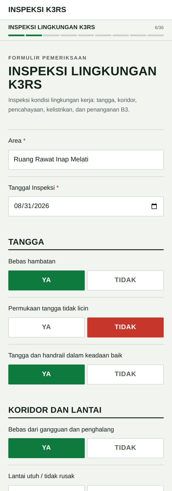
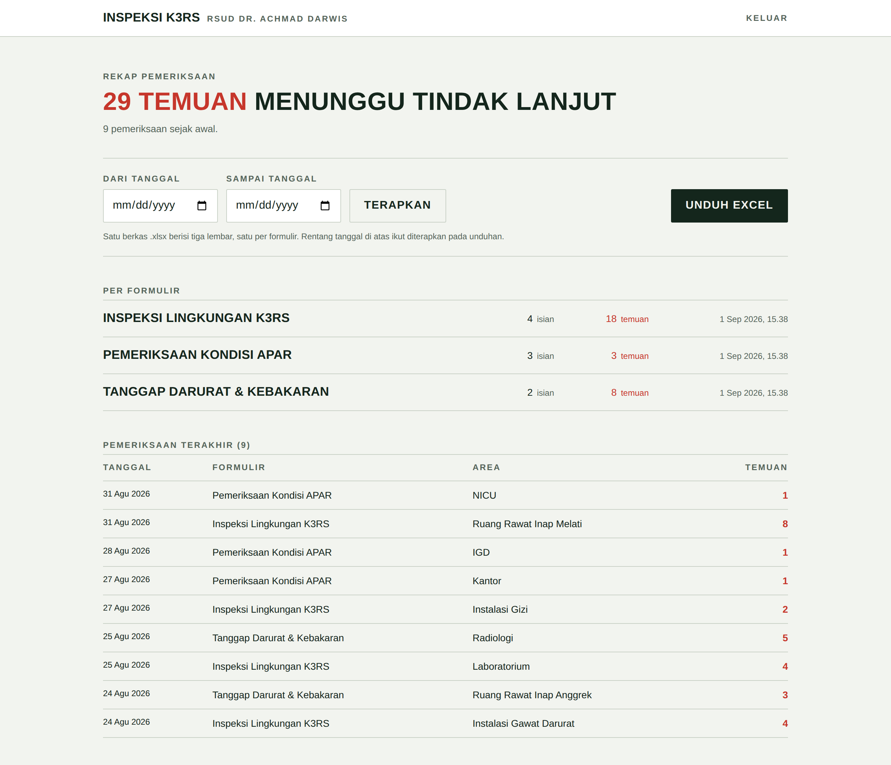

# InsMobile (Inspeksi K3RS)

Nama **InsMobile** (inspeksi mobile) adalah nama sistem ini dalam Rancangan
Aktualisasi Arif Rahman Hakim — PD CPNS Kabupaten Lima Puluh Kota 2026.

Website pemeriksaan K3RS untuk **RSUD dr. Achmad Darwis**. Tiga formulir
diisi dari ponsel saat ronde, tersimpan di Neon Postgres, dan direkap di
`/admin` dengan unduhan Excel.

Menggantikan tiga Google Form yang sebelumnya dipakai. Pertanyaan, pilihan
jawaban, dan status wajib-isi disalin apa adanya dari form asli.

| Formulir | Rute | Jumlah pertanyaan |
| --- | --- | --- |
| Inspeksi Lingkungan K3RS | `/forms/inspeksi-lingkungan` | 36 dalam 8 bagian |
| Pemeriksaan Kondisi APAR | `/forms/kondisi-apar` | 10 |
| Tanggap Darurat & Kebakaran | `/forms/tanggap-darurat` | 19 dalam 2 bagian |

## Tampilan

Formulir diisi dari ponsel: satu ketukan per pertanyaan, hijau untuk kondisi
aman dan merah untuk temuan. Progres tersimpan di perangkat, jadi ronde yang
terputus bisa dilanjutkan.

<p align="center">
  
</p>

## Menjalankan secara lokal

```bash
npm install
cp .env.example .env.local   # lalu isi nilainya
npm run dev
```

Buka <http://localhost:3000>.

## Variabel lingkungan

| Nama | Wajib | Keterangan |
| --- | --- | --- |
| `DATABASE_URL` | ya | Connection string Neon Postgres. `DATABASE_URL_UNPOOLED` dipakai bila `DATABASE_URL` kosong. |
| `ADMIN_USERNAME` | ya | Nama pengguna untuk `/admin`. |
| `ADMIN_PASSWORD` | ya | Kata sandi untuk `/admin`. |
| `SESSION_SECRET` | ya | Penanda tangan cookie sesi. Minimal 32 karakter acak. |

Membuat `SESSION_SECRET`:

```bash
node -e "console.log(require('crypto').randomBytes(36).toString('base64url'))"
```

## Basis data

Tabel dibuat otomatis saat permintaan pertama — tidak ada langkah migrasi
terpisah. Semua jawaban disimpan di satu tabel:

```
submissions(id, form_slug, area, inspection_date, answers jsonb, findings, created_at)
```

`answers` memakai id pertanyaan asli dari Google Form (`q<entry-id>`), sehingga
kolom tetap cocok meskipun teks pertanyaan diubah di kemudian hari.
`findings` menghitung jawaban `Tidak` dan `Rusak` — angka inilah yang
ditampilkan di rekap admin.

## Halaman admin

`/admin` meminta login, lalu menampilkan:

- jumlah temuan dan pemeriksaan pada rentang tanggal yang dipilih,
- ringkasan per formulir,
- 50 pemeriksaan terakhir,
- tombol **Unduh Excel**.

<p align="center">
  
</p>

Berkas `.xlsx` berisi tiga lembar, satu per formulir. Satu baris = satu
pemeriksaan, satu kolom = satu pertanyaan, ditambah kolom `Jumlah temuan`.
Jawaban `Tidak`/`Rusak` diwarnai merah. Rentang tanggal di halaman admin ikut
diterapkan pada unduhan.

## Data contoh untuk tangkapan layar

Tangkapan layar di atas dibuat dengan data fiktif. Untuk membuatnya ulang,
jalankan `npm run dev` lalu:

```bash
npm run seed:demo            # isi 9 pemeriksaan contoh
npm run seed:demo -- --clean # hapus kembali baris yang tadi diisi
```

Baris contoh masuk lewat `POST /api/submit`, jadi ikut divalidasi seperti
pengisian sungguhan. Id yang terbentuk dicatat di `scripts/.demo-ids.json`;
`--clean` hanya menghapus id itu, tidak pernah baris lain. Skrip menolak
mengisi tabel yang sudah berisi data kecuali diberi `--force`.

## Mengubah pertanyaan

`src/lib/forms.ts` dibuat otomatis dari HTML Google Form asli. Untuk
menyesuaikan pertanyaan, sunting berkas itu langsung — strukturnya sudah
tidak bergantung pada Google Form lagi. Tambahkan pertanyaan baru dengan id
yang belum pernah dipakai; jangan mengubah id lama, karena id itulah yang
mengikat data lama ke kolomnya.

## Deploy

Deploy ke Vercel. Setel keempat variabel lingkungan di **Project Settings →
Environment Variables** sebelum deploy pertama.
